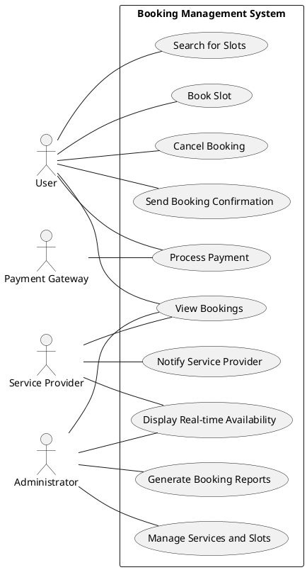
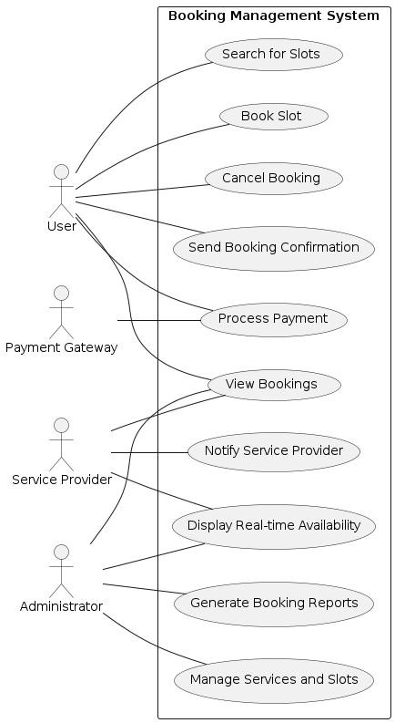

# Requirement Analysis in Software Development.
The Requirement Analysis Project focuses on crafting a comprehensive foundation for software development by documenting, analyzing, and structuring requirements. Through a series of well-defined tasks, learners will create a detailed blueprint of the requirement analysis phase for a booking management system. This project simulates a real-world development scenario, emphasizing clarity, precision, and structure in defining requirements to set the stage for successful project execution.

## What is Requirement Analysis?
Requirement Analysis is the process of studying user needs to arrive at a definition of system, software, or hardware requirements. It involves defining, documenting, and maintaining requirements, as well as managing and tracking them. It's not just about collecting what stakeholders say they want, but actively scrutinizing, refining, and organizing those desires into a clear, unambiguous, and consistent set of requirements that the development team can build upon.

It typically takes the raw, often unrefined output from the Requirement Elicitation phase (where information is "drawn out" from stakeholders) and transforms it into a structured, verifiable, and actionable set of specifications.

### Importance of Requirement Analysis in the SDLC
Requirement analysis is arguably the most critical phase in the SDLC because it forms the bedrock upon which all subsequent phases are built. Its importance cannot be overstated:

1. Foundation for Design and Development: Clear requirements provide the necessary inputs for architects and developers to design the system's structure and write code. Without clear requirements, development efforts can go in the wrong direction, leading to rework.

2. Basis for Testing: Requirements define what needs to be tested. Test cases are derived directly from functional and non-functional requirements, ensuring that the final product meets the specified criteria.

3. Reduces Project Risk and Cost:

    * Identifying and resolving issues early in the analysis phase is significantly cheaper and less time-consuming than fixing them during coding or testing.

    * Prevents building the "wrong" product or missing key functionalities, avoiding costly rework or project abandonment.

4. Ensures Stakeholder Alignment: It ensures that all parties involved (customers, users, management, development team) share a common understanding and vision of the system. This reduces misunderstandings and improves communication.

5. Manages Scope: By defining clear boundaries and prioritizing requirements, it helps prevent uncontrolled growth of the project scope, keeping it on track and within budget.

6. Increases User Satisfaction: A system built on well-analyzed requirements is more likely to meet actual user needs and expectations, leading to higher user adoption and satisfaction.

7. Improved Project Planning and Estimation: Clear requirements enable more accurate estimates for time, resources, and budget, leading to more realistic project plans.

## Why is Requirement Analysis Important?
  * **Clarity and Understanding:** It helps in understanding what the stakeholders expect from the software, reducing ambiguity.
  * **Scope Definition:** Clearly defines the scope of the project, which helps in preventing scope creep.
  * **Basis for Design and Development:** Provides a solid foundation for designing and developing the system.
  * **Cost and Time Estimation:** Facilitates accurate estimation of project cost, resources, and time.
  * **Quality Assurance:** Ensures that the final product meets the specified requirements, leading to higher customer satisfaction.

## Key Activities in Requirement Analysis.
* **Requirement Gathering**: This is the initial, overall process of collecting all information related to the desired software system from various sources.
* **Requirement Elicitation**: This involves actively and proactively drawing out hidden, unstated, or incomplete needs from stakeholders using specific techniques.
* **Requirement Documentation**: This activity focuses on formally writing down the identified and analyzed requirements in a clear, consistent, and traceable manner.
* **Requirement Analysis and Modeling**: This involves scrutinizing, refining, organizing, and creating visual representations of requirements to ensure clarity, consistency, and feasibility.
* **Requirement Validation**: This is the crucial step of verifying that the documented requirements are correct, complete, and truly meet the stakeholders' needs and business goals.

## Types of Requirements.
### Functional Requirements
A **functional requirement** specifies what a system must do or perform in terms of its behavior and capabilities.
Here's a list of functional requirement examples for a Booking Management System:
* The system shall allow hotel managers to update hotel information through a separate portal.
* The system shall enable customers to search for hotels.
* The system shall enable customers to book hotels.
* The booking service shall interact with a third-party payment service.
* The system shall display current booking details to customers.
* The system shall provide notifications to customers.
* The system shall store data in Hadoop for BigData analysis.
* The system shall perform business analysis based on stored data.
### Non-functional Requirements
A **non-functional requirement (NFR)** specifies how well the system performs its functions, describing its quality attributes, constraints, and operational characteristics.
Here's a list of non-functional requirement examples for a Booking Management System:
* The system shall manage high user traffic.
* The Hotel Management Service shall handle requests efficiently via a load balancer.
* The Hotel Management Service's Hotel DB cluster shall support efficient read/write operations.
* The system shall send data updates to a CDN.
* The system shall send data updates to a Messaging Queue System for further processing.
* The booking service shall use Redis for caching.
* Cassandra shall handle large volumes of historical data.
* The notification system shall use Kafka consumers.
* The BigData analysis service shall use Apache Streaming.

## Use Case Diagrams.
### What are Use Case Diagrams?
A **Use Case Diagram** is a type of Unified Modeling Language (UML) diagram that visually represents the functionality of a system from an external point of view. It shows what the system does by illustrating the interactions between users (or other external systems, called "actors") and the system's functions (called "use cases"). It's a high-level, abstract view, focusing on the goals that users achieve with the system rather than the internal details of how the system performs those goals.

**Key Components of a Use Case Diagram:**

1. Actor: Represented by a stick figure, an actor is a role played by a user or another system that interacts with the system being modeled. An actor is outside the system.
    * Example: Customer, Administrator, Payment Gateway.

2. Use Case: Represented by an oval, a use case describes a specific goal-oriented functionality that the system provides to an actor. Each use case represents a distinct piece of user-observable functionality.
    * Example: Place Order, Log In, Manage Inventory.

3. System Boundary: Represented by a rectangle, this box encloses all the use cases, distinguishing them from the actors. It defines the scope of the system being modeled. Actors are placed outside this boundary.

4. Relationships: Lines connecting actors to use cases or connecting use cases to each other.
    * Association (Actor-Use Case): A simple line connecting an actor to a use case, indicating that the actor participates in or initiates that use case.

    * Include (`<<include>>`): Used when a particular piece of functionality (one use case) is an integral part of another use case. The included use case is always executed.

        * Example: "Place Order" `<<includes>>` "Process Payment".

    * Extend (`<<extend>>`): Used when a use case adds optional or conditional functionality to another use case. The extending use case is executed only under specific conditions.

        * Example: "Process Order" `<<extends>>`     "Handle Fraudulent Payment."

    * Generalization (Inheritance): Less common, but can show that one actor or use case is a specialized version of another.

### Benefits of Using Use Case Diagrams
Use Case Diagrams offer several significant benefits throughout the SDLC:

1. **Clarity and Simplicity:**
    * Easy to Understand: They are intuitive and non-technical, making them easily understandable by both technical and non-technical stakeholders (e.g., business users, customers, developers, testers).
    * High-Level Overview: They quickly provide a clear, high-level picture of what the system does without getting bogged down in implementation details.

2. **Effective Communication:**
    * Common Language: They establish a shared vocabulary between business users and technical teams, bridging the communication gap.
    * Stakeholder Engagement: Their simplicity encourages active participation and feedback from clients and business users, as they can easily see and validate the system's proposed functionality.

3. **Scope Definition and Management:**
    * Boundary Definition: The system boundary clearly delineates what is part of the system and what is external, helping to define the project scope.
    * Prevents Scope Creep: By explicitly defining functionalities at the outset, they help manage expectations and reduce the likelihood of uncontrolled feature additions.

4. **Foundation for Requirements and Design:**
    * Elicitation Aid: They can be used during requirements elicitation to identify primary functions and user goals.
    * Basis for Detailed Requirements: Each use case can later be elaborated into a detailed use case description (main flow, alternative flows, preconditions, postconditions), or broken down into multiple user stories, providing granular requirements for development.
    * Input for Design: They help architects and designers understand the overall system behavior, informing the high-level system architecture and module design.

5. **Test Case Generation:**
    * Verifiability: Each use case represents a testable scenario. Testers can use the use case diagrams and their detailed descriptions as a direct basis for creating test plans and test cases, ensuring that all identified functionalities are thoroughly tested.

6. **User-Centric Perspective:**
    * By focusing on actors and their goals, use case diagrams ensure that the system is designed from the perspective of its users, leading to a more user-friendly and valuable product.

## Sample Use-Case Diagram

## Screenshot

## Acceptance Criteria.